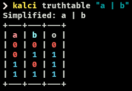
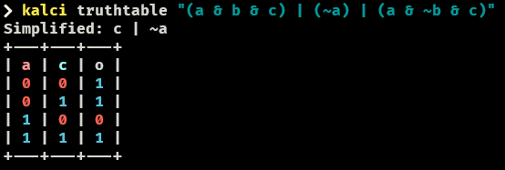

# Kalci
A CLI based calculator made in python.
It has features like Algebra, Expression Simplification, Evaluation, Derivatives, Integrals, Unit Conversion, etc.

## Dependencies
Python 3.11 or above required

Packages:
1. [Tabulate](https://pypi.org/project/tabulate/)
2. [SymPy](https://pypi.org/project/sympy/)
3. [Typer](https://pypi.org/project/typer/)
4. [Pryttier](https://pypi.org/project/pryttier/)

## Installation
1. Clone this Repo using `git clone https://github.com/HussuBro010/Kalci.git`
2. Open terminal and type `cd <path>`. Replace `<path>` with the path to the cloned repo
3. To use it just type `dist/kalci.exe --help`.
4. To use it anywhere add the absolute path of the dist folder to environment path variables.

## Tutorial
After the installation, you can type `kalci --help` to get a list of all the commands.
In this section we will be covering all the commands.

For a specific command, you can get help (arguments) by
```command
kalci <command> --help
```

### 1. Simplify
**Usage:** `kalci simplify <expr>`

Simplfies an expression to simplest terms

**Ex:**
```command
kalci simplify 10**3
> 1000

kalci simplify "sin(45)"
> sin(45)

kalci simplify "sqrt(8)"
> 2⋅√2
```

**Note:** `expr` argument has to pythonic. ex: `5*x**2` instead of `5x^2`.
Write the `expr` in `""` if it contains spaces, commas, dots, parenthesis, brackets, etc.
This is true for every command with an `expr` argument.

### 2. Evaluate
**Usage:** `kalci evaluate <expr>`

It is the same as `simplify` but makes sure that the answer is in decimal (floating point).

**Ex:**
```command
kalci evaluate 10**3
> 1000.00

kalci evaluate "sin(45)"
> 0.745113160479349

kalci evaluate "sqrt(8)"
> 2.82842712474619
```

### 3. Factorize
**Usage:** `kalci factorize <expr>`

Factorizes given expression

**Ex:**
```command
kalci factorize "x**2 + 2*x + 15"
   2
> x  + 2⋅x + 15

kalci factorize "x**2 + 9*x + 14"
> (x + 2)⋅(x + 7)

kalci factorize "x**3+x**2"
   2
> x ⋅(x + 1)

```

### 4. Expand
**Usage:** `kalci expand <expr>`

Same as simplification. Expands factorized expressions. (Reverse of `factorize`)

**Ex:**
```command
kalci expand "x**2 * (x + 1)"
   3    2
> x  + x

kalci expand "(x + 2)(x + 7)
   2
> x  + 9⋅x + 14
```

### 5. Solve For
**Usage:** `kalci solvefor <equation> <solvefor>`

Solve for an expression in an equation (seperated by `=`). Will print a list of solutions

**Ex:**
```command
kalci solvefor "2*x + 5 = 10" x
> [5/2]
kalci solvefor "x**2 - 12 = 37" x
> [-7, 7]
```

### 6. Roots
**Usage:** `kalci roots <expr>`

Calculates the roots (both real and imaginary) of a polynomial

**Ex:**
```command
kalci roots "x**2 + x"
> [-1, 0]
kalci roots "x**4 + x**3 + x**2 + x"
> [-1, -ⅈ, ⅈ, 0]
```

### 7. Derive
**Usage:** `kalci roots <expr> <syms>`

Calculates the derivative of the expression with respect to given variables.
Provide multiple variables to compute derivative multiple times

**Ex:**
```command
kalci derive "5*x**3" x
      2
> 15⋅x
kalci derive "5*x**3" x x x
> 30

kalci derive "5*x*y" x
> 5⋅y
kalci derive "5*x*y" y
> 5⋅x
kalci derive "5*x*y" x y
> 5
```

### 8. Integrate
**Usage:** `kalci integrate <expr> <syms>`

Calculates the anti-derivative of the expression with respect to given variables.
Provide multiple variables to compute anti-derivative multiple times.
Equivalent to an indefinite integral

**Ex:**
```command
kalci integrate "x" x
   2
> x
  ──
  2

kalci integrate "10*x*y*y" x
     2  2
> 5⋅x ⋅y
kalci integrate "10*x*y*y" y
        3
> 10⋅x⋅y
  ───────
     3
kalci integrate "10*x*y*y" x y
     2  3
> 5⋅x ⋅y
  ───────
     3

```
### 9. Definite Integrate
**Usage:** `kalci integrate-def <expr> <syms>`

Calculates the anti-derivative of the expression with respect to given variables within provided bounds.
Provide multiple variables to compute anti-derivative multiple times.
Equivalent to an Definite integral.

**Note:** For this one, variables must be in a single string separated by spaces.
`"x x"` instead of `x x`

**Bound syntax**: "lower->upper". All bounds must be in one string separated by spaces.
You can either have one bound or bounds per integration.
If you provide only one bound then the expression will be evaluated after all integrations.
If you provide bounds per integration then it will evaluate after each integration.

**Ex:**
```command
kalci integrate-def "x" "x" "0->1"
> 1/2
kalci integrate-def "x" "x x" "0->1"
> 1/6

kalci integrate-def "x/(sqrt(y))" "x y" "0->1, 0->2"
> √2
```

`kalci integrate-def "x/(sqrt(y))" "x y" "0->1, 0->2"`
is equivalent to

$$\int_{0}^{2}{\int_0^1 \frac{x}{\sqrt{y}} \space dx \space dy}$$

### 10. Truthtable
**Usage:** `kalci truthtable <expr>`
Generates a truthtable for a given boolean expression.
`expr` argument has to be a boolean expression.

**Ex:**





### 11. Convert
**Usage** `kalci convert <utype> <u1> <u2> <num>`

Converts units.

Supported Unit types:
- Length
- Area
- Volume
- Mass
- Freq

**Ex:**
```command
kalci convert length m km 1
> 0.001

kalci convert mass kg lb 1
> 2.2046244201837775
```

### 12. Roll
**Usage:** `kalci roll <n>`

Rolls n die. Multiple n can be provided too

**Ex:**
```command
kalci roll 6
> 4
  Total: 4
  Max: 4
  Min: 4

kalci roll 6 10
> 1 5
  Total: 6
  Max: 5
  Min: 1

kalci roll 6 6 6 6
> 0 2 5 4
  Total: 11
  Max: 5
  Min: 0
```

### 13. Defvar
**Usage:** `kalci defvar <varname> <value>`

Define a variable which can be used anywhere. The `value` argument follows same rule as `expr`

**Ex:**
```command
kalci defvar A x**2
kalci simplify "A + A"
     2
> 2⋅x

kalci defvar B "(x + 2)"
kalci simplify A*B
   2
> x ⋅(x + 2)
```

### 14. Rmvar
**Usage:** 'kalci rmvar <varname>'

Removes given variable

**Ex:**
```command
kalci defvar A x**2
kalci simplify "A + A"
     2
> 2⋅x

kalci rmvar A
kalci simplify "A + A"
> 2⋅A
```

### 15. Pvars
**Usage:** `kalci pvars`

Prints all defined variables

**Ex:**
```command
kalci defvar A "5*x"
kalci defvar B "2*x**2"
kalci defvar C "1/(2*x)"

kalci pvars
> A: 5*x
  B: 2*x**2
  C: 1/(2*x)

```

### 16. Clv
**Usage:** `kalci clv`

Removes all Variables

**Ex:**
```
kalci defvar A "5*x"
kalci defvar B "2*x**2"
kalci defvar C "1/(2*x)"

kalci pvars
> A: 5*x
  B: 2*x**2
  C: 1/(2*x)

kalci clv

kalci pvars
>
```

Those are all the features available right now. Tutorial for upcoming new features will be added here.

